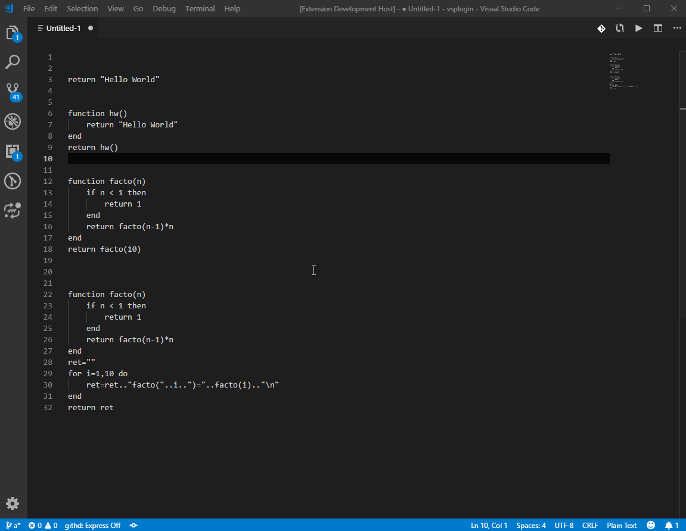

# Lua eval
Eval selected code on the editor as a Lua code and replace with return value.
## Usage
1. Select a lua code.
2. Type `lua-eval` into the command palette and execute.
3. Selected code is going to be replaced with the return value.


### sample codes
#### 1
```
return "Hello World"
```
↓ `lua-eval`
```
"Hello World"
```
#### 2
```
function hw()
    return "Hello World"
end
return hw()
```
↓ `lua-eval`
```
"Hello World"
```
#### 3
```
function facto(n)
    if n < 1 then
        return 1
    end
    return facto(n-1)*n
end
return facto(10)
```
↓ `lua-eval`
```
3628800
```
#### 4
```
function facto(n)
    if n < 1 then
        return 1
    end
    return facto(n-1)*n
end
ret=""
for i=1,10 do
    ret=ret.."facto("..i..")="..facto(i).."\n"
end
return ret
```
↓ `lua-eval`
```
facto(1)=1
facto(2)=2
facto(3)=6
facto(4)=24
facto(5)=120
facto(6)=720
facto(7)=5040
facto(8)=40320
facto(9)=362880
facto(10)=3628800
```